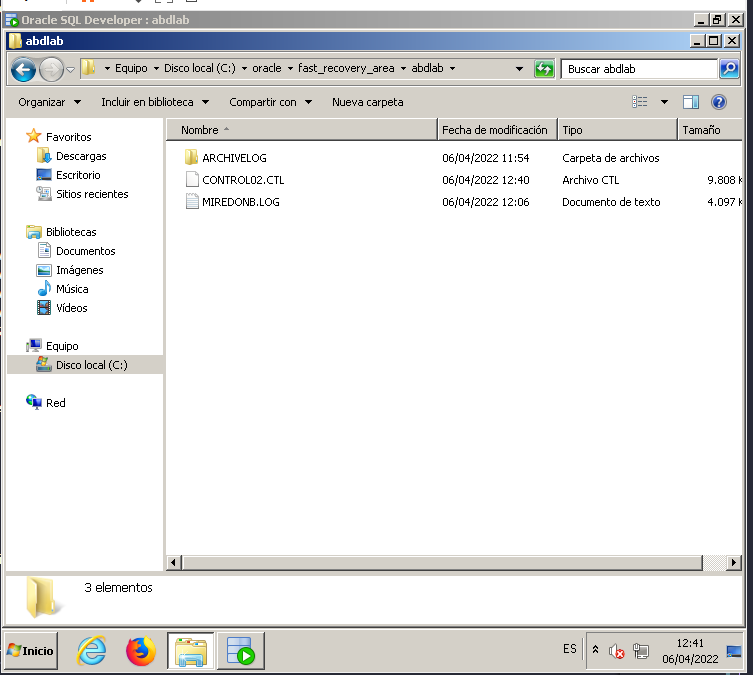

# Laboratorio __Arquitectura del SGBD Oracle__

__1. Entender la organización de Oracle__

- Buscar los ficheros de datos, redo log, control. Para ello en la sesión de SYS acceder a las
vistas v$datafile y v$controlfile (atributo name), y v$logfile (atributos group# y member). Para buscar el fichero de parámetros de inicialización show parameter spfile y comprueba su ubicación en la carpeta correspondiente.

||Carpeta|Ficheros|
|-|-|-|
|Ficheros Redo log|ORADATA|REDO01.LOG REDO02.LOG REDO03.LOG|
|Ficheros de control|ORADATA FAST_RECOVERY_AREA|CONTROL01.CTL CONTROL02.CTL |
|Ficheros de Datos|ORADATA|SYSTEM01.DBF SYSAUX01.DBF UNDOTBS01.DBF USERS01.DBF|
|Ficheros de Parámetros de Inicialización| DATABASE| SPFILEABDLAB.ORA|

- Para comprobar el tamaño de la memoria SGA (System Global Area): __show sga__

||Tamaño|
|-|-|
|SGA| 838860800 bytes  |
|Buffers de la BD|318767104 bytes |
|Buffers de Redo|5337088 bytes  |
|Resto|3051184 bytes + 511705424 bytes|

- Para comprobar las características de la Base de Datos, acceder a la vista __v$database__ con
estos atributos: __dbid__ (identificador interno de la BD), __name__, __created__ (fecha de creación), __log_mode__, __open_mode__.

||v$database|
|-|-|
|dbid: 973164796|log_mode: NOARCHIVELOG|
|name: ABDLAB|open_mode: READ WRITE|
|created: 24/07/17 ||

- Para comprobar las características de la instancia acceder a la vista __v$thread__ con estos atributos: __thread#__, __status__, __enabled__ (qué usuarios pueden acceder), __groups__ (cuántos grupos de redo log tiene definidos), __instance__ (nombre de la instancia), __open_time__, __current_group#__ (de entre los grupos de redo log, cuál es el actual, en cuál está escribiendo el sistema), __sequence#__ (número de secuencia del grupo de redo actual), __checkpoint_change#__ (el número del último cambio al realizar un punto de sincronización), __checkpoint_time__ (cuándo se ha realizado el último punto de sincronización)

||v$thread|
|-|-|
|thread#: 1|open_time: 04/04/22|
|status: OPEN|current_group#: 3|
|enabled: PUBLIC|sequence#: 24|
|groups: 3|checkpoint_change#: 972761|
|instance: abdlab |checkpoint time:04/04/22 |

- Para comprobar los parámetros de inicialización: El fichero de parámetros ha sido
construido por el asistente de creación de bases de datos en función de las opciones
elegidas en las diferentes etapas por las que pasa el asistente en el proceso de construcción
de una nueva base de datos. Ejecuta create pfile from spfile; y estudia los parámetros
recogidos en el fichero C:\oracle\db12\database\initabdlab.ora que se ha generado.
Los parámetros que van precedidos por abdlab.__ son parámetros a los que ha asignado
valor automáticamente la propia base de datos. Toma nota de sus valores. (Podría verse
ejecutando show parameter pero aparecen muchos más)

|Parametro|Valor|
|-|-|
audit_file_dest | 'C:\oracle\admin\abdlab\adump'
audit_trail | 'db'
compatible | '12.1.0.2.0'
control_files |'C:\oracle\oradata\abdlab\control01.ctl' 'C:\oracle\fast_recovery_area\abdlab\control02.ctl'
db_block_size | 8192
db_domain | 'si.ehu.es'
db_name | 'abdlab'
db_recovery_file_dest | 'C:\oracle\fast_recovery_area'
db_recovery_file_dest_size | 24080m
diagnostic_dest | 'C:\oracle'
memory_target | 800m
open_cursors |300
processes |300
remote_login_passwordfile | 'EXCLUSIVE'
sec_case_sensitive_logon | TRUE
undo_tablespace | 'UNDOTBS1'

- Puedes ver que la instalación de Oracle con la que se ha trabajado en los otros laboratorios
es similar a la de esta máquina virtual. Desde una sesión con tu usuario ABDn puedes
realizar las mismas consultas de los apartados a-d. Para ver los parámetros de inicialización
puedes realizar la consulta __select name, value from v$parameter where isdefault='FALSE'__

__2. Espacios de tablas (tablespaces)__

Las tablas y otros objetos de la base de datos se almacenan en las secciones de disco
denominadas ‘espacios de tablas’ (tablespace). En este ejercicio crearemos uno de esos
espacios y guardaremos ahí una de nuestras tablas.

- Aparte de los espacios de tablas que están ya creados en la base de datos, crea un espacio
de tablas, con nombre __espacioN__ (donde N es el número de tu usuario ABDn). Para ello,
ejecutar esta instrucción:

__create tablespace espacioN datafile 'C:\ORACLE\ORADATA\ABDLAB\espacioN.dbf' size 200k;__

- Comprobar que el fichero se ha creado en la carpeta indicada. Así mismo, con la conexión
como DBA en la carpeta “Almacenamiento+Tablespaces”, comprobar las características del
nuevo espacio de tablas.

- Asigna al usuario __usuario1__ su cuota ‘unlimited’ sobre el espacio de tablas __espacioN__.

- En la sesión del usuario1 c rear un a nueva tabla en el espacio espacioN, con la siguiente
instrucción:

__create table PRUEBA (COD NUMBER) tablespace ESPACION__

Insertar alguna tupla en la tabla creada. Ahora, ¿cuántos bytes tiene ocupados el espacio de
tablas?

- Desde la conexión como DBA borrar el espacio de tablas que acabamos de crear (borrando
también los objetos incluidos en él) pero manteniendo el fichero físico espacioN.dbf.
Comprueba que así ha sido. ('C:\ORACLE\ORADATA\ABDLAB\espacioN.dbf'). Asignar de
nuevo al usuario1 el tablespace USERS con cuota ilimitada.

__3. Ficheros de Redo Log__

Modifica el formato de la fecha para que muestre también la hora ALTER SESSION SET
nls_date_format = 'YYYY-MON-DD HH24:MI:SS';

- Analizar la localización de los ficheros de redo log de la base de datos y la composición de
los grupos. Para comprobar cuántos grupos de redo log hay y sus miembros, la vista
__v$logfile__ con los atributos: __group# y __member__. Para analizar las características de los
grupos, la vista __v$log__ con sus atributos: __group#__ (número del grupo), __sequence#__
(número de secuencia actual), __bytes__ (tamaño), __members__ (número de miembros),
__archived__ (si está archivado o no), __status__ (estado actual), __first_change#__ (número que
corresponde a la primera modificación almacenada en el fichero) y __first_time__ (cuándo se
ha empezado a utilizar el grupo). ( Valores del atributo status: UNUSED – el grupo de redo
log no se ha utilizado nunca, CURRENT- el grupo es el actual (también está activo), ACTIVE
– el grupo está activo, pero no es el actual, INACTIVE – el grupo no es necesario en un
proceso de recuperación hipotético)

|||||
|-|-|-|-|
|group#|1|2|3|
|Ficheros redo log|C:\ORACLE\ORADATA\ABDLAB\REDO01.LOG|C:\ORACLE\ORADATA\ABDLAB\REDO02.LOG|C:\ORACLE\ORADATA\ABDLAB\REDO03.LOG|
|members|1|1|1|
|sequence#|25|26|24|
|bytes|67108864|67108864|67108864|
|archived|NO|NO|NO|
|status|INACTIVE|CURRENT|INACTIVE|
|first_change#|1078226|1182966|972760|
|first_time|2022-ABR-04 15:28:27|2022-ABR-05 16:11:56|2022-ABR-04 10:06:07|

- Para comprobar el modo de log y el modo de archivo de la base de datos, acceder a las
vistas __v$database__ (atributo __log_mode__) y __v$instance__ (atributo __archiver__),
respectivamente.

|||
|-|-|
|modo log| NOARCHIVE LOG|
|proceso| STOPPED|

- <u>Añadir un grupo de ficheros redo log</u>, ejecutando esta instrucción (__N__ es el número
asignado).

``alter database add logfile 'C:\ORACLE\ORADATA\ABDLAB\MIREDON.LOG' size 4M;``

Para analizar el estado de los nuevos ficheros de redo log acceder a la vista __v$logfile__ y sus
atributos: __group#__ y __member__. Y también la vista __v$log__ al menos con los atributos __group#__, __status__ y __members__. Analizar el número asignado al grupo de ficheros de redo log que habéis creado (suponiendo que es __X__)

v$logfile

|group#|member|
|-|-|
1 |C:\ORACLE\ORADATA\ABDLAB\REDO01.LOG
2 | C:\ORACLE\ORADATA\ABDLAB\REDO02.LOG
3 | C:\ORACLE\ORADATA\ABDLAB\REDO03.LOG
4 | C:\ORACLE\ORADATA\ABDLAB\MIREDON.LOG

v$log

|group#|status|members|
|-|-|-|
1 | INACTIVE | 1
2 | CURRENT	| 1
3 | INACTIVE | 1
4 | UNUSED | 1

- <u>Añadir un miembro a un grupo de ficheros de redo log</u>. Añadir un miembro al grupo que se
ha creado en el paso anterior, usando la siguiente instrucción (donde __N __es el número
asignado y __X__ es el número del grupo creado en el ejercicio anterior). Comprobar que el
tamaño del nuevo fichero coincide con el del otro miembro del mismo grupo.

``alter database add logfile member 'C:\ORACLE\FAST_RECOVERY_AREA\ABDLAB\MIREDONB.LOG' to group 4;``

Comprobar el estado de los ficheros de redo log con las vistas __v$logfile__ y __v$log__.

v$logfile

|group#|member|
|-|-|
1 | C:\ORACLE\ORADATA\ABDLAB\REDO01.LOG
2 | C:\ORACLE\ORADATA\ABDLAB\REDO02.LOG
3 | C:\ORACLE\ORADATA\ABDLAB\REDO03.LOG
4 | C:\ORACLE\ORADATA\ABDLAB\MIREDON.LOG
4 | C:\ORACLE\FAST_RECOVERY_AREA\ABDLAB\MIREDONB.LOG

v$log

|group#|status|members|
|-|-|-|
1 | INACTIVE | 1
2 | CURRENT | 1
3 | INACTIVE | 1
4 | UNUSED | 2

- <u>Eliminar un miembro de un grupo de ficheros de redo log</u>, ejecutando esta instrucción
(donde N es el número asignado).

``alter database drop logfile member 'C:\ORACLE\FAST_RECOVERY_AREA\ABDLAB\MIREDONB.LOG';``

Comprobar que el fichero miredoNB.log sigue físicamente en la carpeta <i>C:\ORACLE\FAST_RECOVERY_AREA\ABDLAB</i>

- Borrar un grupo de ficheros de redo log, ejecutando esta instrucción (donde X es el número
del grupo creado en un ejercicio anterior).

``alter database drop logfile group X;``

Comprobar el estado de los ficheros de redo log con las vistas v$log.

|group#|status|members|
|-|-|-|
1 | INACTIVE | 1
2 | CURRENT | 1
3 | INACTIVE | 1

- <u>Cambio de los ficheros de redo log</u>. Primeramente comprobar el estado de los ficheros de
redo log (1), con la vista v$log (atributos group#, status y sequence#).

Cuando un fichero de redo log se llena automáticamente se utilizará el siguiente. Simulamos
esta situación forzando el cambio de fichero redo log. Realizar el cambio de ficheros de redo
log, ejecutando esta instrucción : alter system switch logfile. Posteriormente comprobar
el estado de los ficheros de log (2). Repetir el proceso otras 2 veces (3) (4), comprobando
cómo va cambiando el estado y número de secuencia de los ficheros de redo log

(1)

|group#|status|sequence#|
|-|-|-|
1 | INACTIVE | 25
2 | CURRENT | 26
3 | INACTIVE | 24

(2)
|group#|status|sequence#|
|-|-|-|
1 |INACTIVE	 | 25
2 | ACTIVE	| 26
3 | CURRENT	| 27

(3)
|group#|status|sequence#|
|-|-|-|
1 | CURRENT | 28
2 | ACTIVE | 26
3 | ACTIVE | 27

(4)

|group#|status|sequence#|
|-|-|-|
1 | INACTIVE | 25
2 | CURRENT | 26
3 | INACTIVE | 24

- <u>Archivado de los ficheros de redo log</u>. Primero (1) comprobar el estado de los ficheros de redo log, (con la vista __v$log__ y sus atributos __group#__, __status__ y __sequence#__) y además (2) mirar el contenido de la carpeta que se indica en el parámetro __DB_RECOVERY_FILE_DEST__ (ó __LOG_ARCHIVE_DEST_1__).

|group#|status|sequence#|first_change#|
|-|-|-|-|
1 | INACTIVE | 28 | 1190528
2 | CURRENT | 29 |1190606
3 | INACTIVE |27 | 1190492

| carpeta $DB_RECOVERY_FILE_DEST |
|-|
abdlab/ARCHIVELOG  
abdlab/CONTROL02.CTL
abdlab/MIREDONB.LOG

- Ejecutar alter system switch logfile (para cambiar el grupo actual).

- Acceder a los atributos group#, status y sequence# de la vista v$log (comprobar
cómo cambia el estado).

|group#|status|sequence#|first_change#|
|-|-|-|-|
1 | INACTIVE | 28 | 1190528
2 | ACTIVE | 29 | 1190606
3 | CURRENT | 30 | 1191048

- Ejecutar __alter system archive log group X__, donde X es el número (group#) del grupo
log que está en estado ACTIVE (está en activo pero no es el a ctual) ( nota: si no hay
ACTIVE, coger el número de log del grupo que estaba como CURRENT antes del
cambio).

- Comprobar la carpeta indicada en el parámetro __DB_RECOVERY_FILE_DEST__ (ó
__LOG_ARCHIVE_DEST_1__). Nota: puede suceder que Oracle borre automáticamente el
contenido de esta carpeta, si el sistema decide que no necesita su contenido.

| carpeta $DB_RECOVERY_FILE_DEST |
|-|
abdlab/ARCHIVELOG  
abdlab/CONTROL02.CTL
abdlab/MIREDONB.LOG

- Acceder a la vista v$log (atributos group#, status y sequence#) para comprobar los
cambios

1	INACTIVE	28	1190528
2	ACTIVE	29	1190606
3	CURRENT	30	1191048